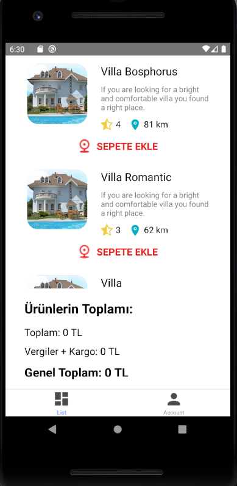
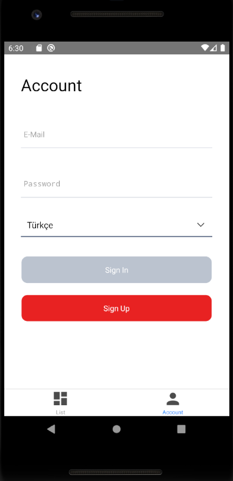
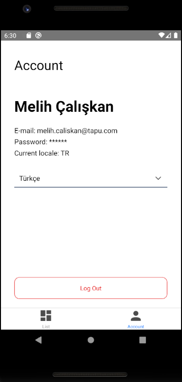
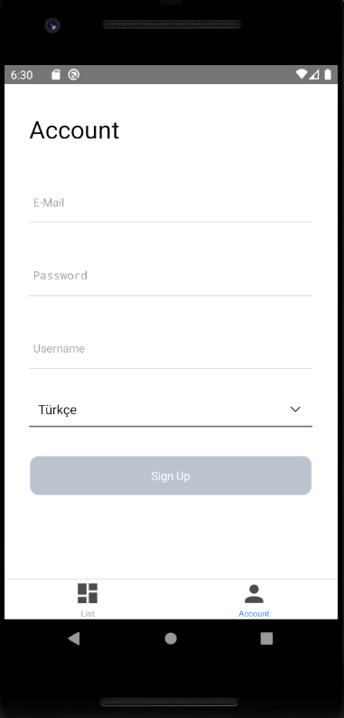

# tapu_store
<div>




</div>

 

## Running Project

In this project, I created an App according to the case_study. I used firebase for authentication, styled components and write some jest tests. You can signup on the signup page or you can use E-mail: melih.caliskan@tapu.com Password: Yd,&6T{RfK5**** for login. You can add products to basket and see total price and also remove from basket with using same button.

After the project is downloaded, the project is opened with the 'Visual Studio Code' editor.

At the terminal;
```
npm install

```
The packages used in the project with the command line are created in the "node_modules" folder.
```
npx react-native start
```
command is run.
```
npx react-native run-android
```
command is run.

If you see white screen, close App and open it again on emulator.